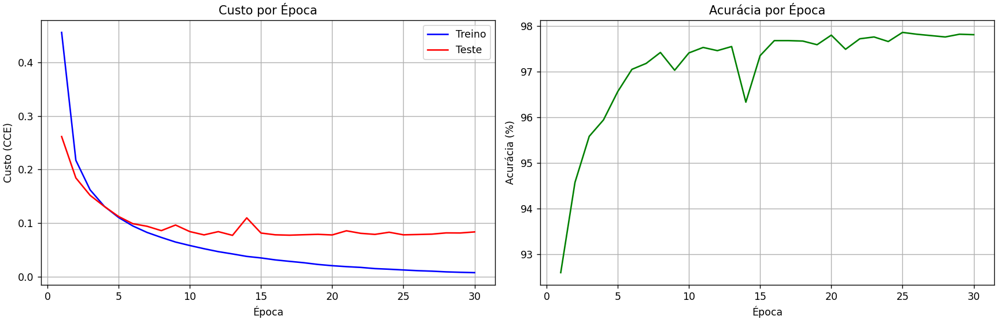
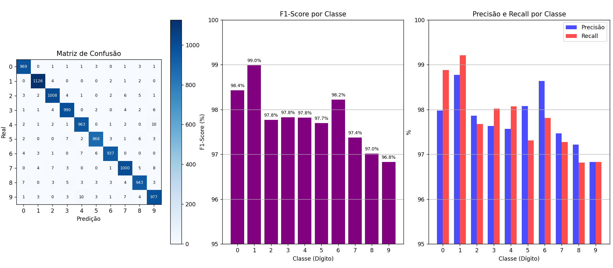
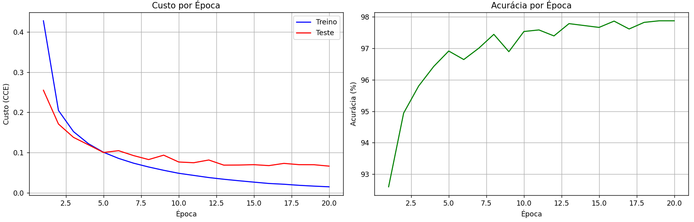
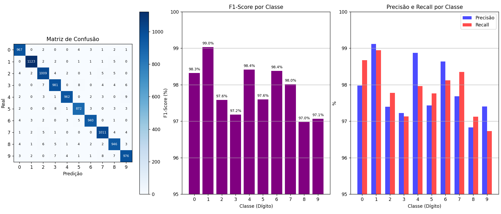

# T1 — Arquitetura Básica de Redes Neurais

**Disciplina:** GEX1083 - Tópicos Especiais em Computação XXXIII - Deep Learning  
**Aluna:** Rafaela Moreno
**Instituição:** Universidade Federal da Fronteira Sul — Campus Chapecó

---

## Descrição

Este trabalho implementa uma Rede Neural Artificial (RNA) feedforward, treinada e avaliada no dataset MNIST,
composto por imagens de dígitos manuscritos (0 a 9). Foram treinadas duas redes com arquiteturas diferentes para comparar
o impacto do número de neurônios e do número de épocas nos resultados.

---

## Dataset — MNIST

O dataset MNIST contém:

- **60.000 exemplos** de treino
- **10.000 exemplos** de teste
- Cada exemplo é uma imagem **28x28 pixels** em escala de cinza
- **10 classes** — dígitos de 0 a 9
- Os pixels foram normalizados de [0, 255] para [0, 1] para
  facilitar o aprendizado da rede
- Os labels foram convertidos para one-hot encoding

---

## Rede 1

### Arquitetura

| Camada   | Neurônios | Ativação   | Inicialização |
| -------- | --------- | ---------- | ------------- |
| Entrada  | 784       | Identidade | —             |
| Hidden 1 | 128       | ReLU       | He            |
| Hidden 2 | 64        | ReLU       | He            |
| Saída    | 10        | Softmax    | Xavier        |

### Hiperparâmetros

| Hiperparâmetro      | Valor                     |
| ------------------- | ------------------------- |
| Função de custo     | Categorical Cross-Entropy |
| Otimizador          | SGD Mini-batch            |
| Taxa de aprendizado | 0.05                      |
| Tamanho do batch    | 64                        |
| Épocas              | 30                        |

### Resultados por época

| Época | Custo Treino | Custo Teste | Acurácia |
| ----- | ------------ | ----------- | -------- |
| 1     | 0.4559       | 0.2616      | 92.59%   |
| 2     | 0.2172       | 0.1844      | 94.57%   |
| 3     | 0.1622       | 0.1519      | 95.58%   |
| 4     | 0.1313       | 0.1311      | 95.94%   |
| 5     | 0.1106       | 0.1124      | 96.56%   |
| 6     | 0.0947       | 0.0990      | 97.05%   |
| 7     | 0.0827       | 0.0942      | 97.18%   |
| 8     | 0.0733       | 0.0860      | 97.42%   |
| 9     | 0.0647       | 0.0965      | 97.03%   |
| 10    | 0.0583       | 0.0842      | 97.41%   |
| 11    | 0.0523       | 0.0781      | 97.53%   |
| 12    | 0.0468       | 0.0842      | 97.46%   |
| 13    | 0.0425       | 0.0772      | 97.55%   |
| 14    | 0.0379       | 0.1098      | 96.33%   |
| 15    | 0.0351       | 0.0815      | 97.35%   |
| 16    | 0.0314       | 0.0782      | 97.68%   |
| 17    | 0.0287       | 0.0775      | 97.68%   |
| 18    | 0.0262       | 0.0784      | 97.67%   |
| 19    | 0.0229       | 0.0791      | 97.59%   |
| 20    | 0.0206       | 0.0780      | 97.80%   |
| 21    | 0.0188       | 0.0857      | 97.49%   |
| 22    | 0.0174       | 0.0810      | 97.72%   |
| 23    | 0.0152       | 0.0790      | 97.76%   |
| 24    | 0.0140       | 0.0830      | 97.66%   |
| 25    | 0.0126       | 0.0782      | 97.86%   |
| 26    | 0.0113       | 0.0788      | 97.82%   |
| 27    | 0.0104       | 0.0795      | 97.79%   |
| 28    | 0.0091       | 0.0818      | 97.76%   |
| 29    | 0.0083       | 0.0817      | 97.82%   |
| 30    | 0.0076       | 0.0836      | 97.81%   |

### Métricas finais

| Métrica                | Valor  |
| ---------------------- | ------ |
| Acurácia geral         | 97.81% |
| Average Class Accuracy | 97.79% |
| Perplexidade           | 1.0872 |

### Métricas por classe

| Classe    | Precisão   | Recall     | F1         |
| --------- | ---------- | ---------- | ---------- |
| 0         | 97.98%     | 98.88%     | 98.43%     |
| 1         | 98.77%     | 99.21%     | 98.99%     |
| 2         | 97.86%     | 97.67%     | 97.77%     |
| 3         | 97.63%     | 98.02%     | 97.83%     |
| 4         | 97.57%     | 98.07%     | 97.82%     |
| 5         | 98.08%     | 97.31%     | 97.69%     |
| 6         | 98.63%     | 97.81%     | 98.22%     |
| 7         | 97.47%     | 97.28%     | 97.37%     |
| 8         | 97.22%     | 96.82%     | 97.02%     |
| 9         | 96.83%     | 96.83%     | 96.83%     |
| **Média** | **97.80%** | **97.79%** | **97.80%** |

### Gráficos

#### Curvas de Aprendizado

#### Avaliação Final

### Análise dos resultados

- A rede convergiu nas primeiras épocas, atingindo 97% de
  acurácia já na época 6. A partir daí o aprendizado desacelerou e
  estabilizou em torno de 97.8%. Talvez seja possível reduzir a
  quantidade de épocas e ainda ter um bom resultado.

- No gráfico de custo é possível ver que o custo de treino continuou
  caindo até o final, mas o custo de teste parou de cair por volta
  da época 10. Indica overfitting leve.

- Na época 14 o custo de teste subiu para 0.1098 e a acurácia
  caiu para 96.33%. Parece que o algoritmo andou na direção errada,
  mas logo voltou ao normal.

- A melhor classe foi o dígito 1 (F1: 98.99%), realmente tem traço simples e menor
  variação de escrita.

- A pior classe (mas não tão ruim) foi o dígito 9 (F1: 96.83%), confundido
  com 4 (10 erros) e 7 (7 erros).

- Acurácia geral (97.81%) e ACA (97.79%) são praticamente iguais,
  devido ao balanceamento do dataset.

- O valor da perplexidade (1.0872) está muito próximo de 1, indicando que o modelo
  está confiante nas suas predições corretas.

## Rede 2

Foi escolhido aumentar os neurônios nas camadas e reduzir a quantidade de épocas para 20.
Mante-se a mesma taxa de aprendizado e demais escolhas.

### Arquitetura

| Camada   | Neurônios | Ativação   | Inicialização |
| -------- | --------- | ---------- | ------------- |
| Entrada  | 784       | Identidade | —             |
| Hidden 1 | 256       | ReLU       | He            |
| Hidden 2 | 128       | ReLU       | He            |
| Saída    | 10        | Softmax    | Xavier        |

### Hiperparâmetros

| Hiperparâmetro      | Valor                     |
| ------------------- | ------------------------- |
| Função de custo     | Categorical Cross-Entropy |
| Otimizador          | SGD Mini-batch            |
| Taxa de aprendizado | 0.05                      |
| Tamanho do batch    | 64                        |
| Épocas              | 20                        |

---

### Resultados por época

| Época | Custo Treino | Custo Teste | Acurácia |
| ----- | ------------ | ----------- | -------- |
| 1     | 0.4278       | 0.2550      | 92.60%   |
| 2     | 0.2047       | 0.1709      | 94.94%   |
| 3     | 0.1520       | 0.1377      | 95.80%   |
| 4     | 0.1218       | 0.1190      | 96.42%   |
| 5     | 0.1005       | 0.1000      | 96.91%   |
| 6     | 0.0853       | 0.1046      | 96.64%   |
| 7     | 0.0734       | 0.0923      | 97.00%   |
| 8     | 0.0639       | 0.0824      | 97.44%   |
| 9     | 0.0557       | 0.0934      | 96.89%   |
| 10    | 0.0483       | 0.0764      | 97.53%   |
| 11    | 0.0430       | 0.0746      | 97.58%   |
| 12    | 0.0377       | 0.0814      | 97.39%   |
| 13    | 0.0334       | 0.0686      | 97.78%   |
| 14    | 0.0297       | 0.0688      | 97.72%   |
| 15    | 0.0263       | 0.0697      | 97.66%   |
| 16    | 0.0229       | 0.0674      | 97.86%   |
| 17    | 0.0210       | 0.0729      | 97.61%   |
| 18    | 0.0183       | 0.0698      | 97.82%   |
| 19    | 0.0163       | 0.0696      | 97.87%   |
| 20    | 0.0146       | 0.0661      | 97.87%   |

---

### Métricas finais

| Métrica                | Valor  |
| ---------------------- | ------ |
| Acurácia geral         | 97.87% |
| Average Class Accuracy | 97.86% |
| Perplexidade           | 1.0683 |

### Métricas por classe

| Classe    | Precisão   | Recall     | F1         |
| --------- | ---------- | ---------- | ---------- |
| 0         | 97.97%     | 98.67%     | 98.32%     |
| 1         | 99.12%     | 98.94%     | 99.03%     |
| 2         | 97.39%     | 97.77%     | 97.58%     |
| 3         | 97.22%     | 97.13%     | 97.18%     |
| 4         | 98.87%     | 97.96%     | 98.41%     |
| 5         | 97.43%     | 97.76%     | 97.59%     |
| 6         | 98.64%     | 98.12%     | 98.38%     |
| 7         | 97.68%     | 98.35%     | 98.01%     |
| 8         | 96.83%     | 97.13%     | 96.98%     |
| 9         | 97.41%     | 96.73%     | 97.07%     |
| **Média** | **97.86%** | **97.86%** | **97.86%** |

---

### Gráficos

#### Curvas de Aprendizado

#### Avaliação Final

---

### Análise dos resultados

- A Rede 2 convergiu de forma mais suave que a Rede 1, atingindo
  97% de acurácia já na época 7 e estabilizando em torno de 97.8%
  a partir da época 13. Não teve quedas bruscas durante o processo.

- O custo de teste caiu de forma mais consistente do que na Rede 1,
  estabilizando em torno de 0.07 a partir da época 13. E o custo de
  teste ainda estava caindo na época 20 ao contrário da Rede 1 onde
  o custo de teste estabilizou mais cedo. Pode ser que com algumas
  épocas a mais, isso melhore.

- A rede 2 segue a mesma tendência da rede 1, confirmando que o dígito 1 (F1: 99.03%)
  é o mais fácil de reconhecer.
- Pra rede 2, a pior classe foi o dígito 8 (F1: 96.98%),
  confundido com outros dígitos de curvas similares como 3 e 5.
- Na rede 2, o dígito 4 (F1: 98.41%) teve uma melhoria significativa
  em relação à Rede 1 (97.82%)

- Acurácia (97.87%) e ACA (97.86%) praticamente idênticas,
  confirmando o balanceamento do dataset MNIST.

- O valor de perplexidade (1.0683) é menor que o da Rede 1 (1.0872), indicando
  que a Rede 2 está mais confiante nas suas predições.

---

## Comparação entre as redes

| Métrica            | Rede 1 (128→64, 30 épocas) | Rede 2 (256→128, 20 épocas) |
| ------------------ | -------------------------- | --------------------------- |
| Acurácia           | 97.81%                     | 97.87%                      |
| ACA                | 97.79%                     | 97.86%                      |
| F1 Médio           | 97.80%                     | 97.86%                      |
| Perplexidade       | 1.0872                     | 1.0683                      |
| Custo treino final | 0.0076                     | 0.0146                      |
| Custo teste final  | 0.0836                     | 0.0661                      |
| Épocas             | 30                         | 20                          |

### Conclusão

- A Rede 2 superou a Rede 1 em todas as métricas principais,
  apesar de ter treinado por 10 épocas a menos, mas por pouca margem.

- A Rede 1 tem um menor custo computacional e entrega um resultado parecido.

- Aparece overfitting nas duas redes (um pouco maior na Rede 1 do que na Rede 2),
  pode sugerir o uso de regularização, mas como a acurácia no teste foi boa em ambos os casos,
  não comprometeu o desempenho geral.
