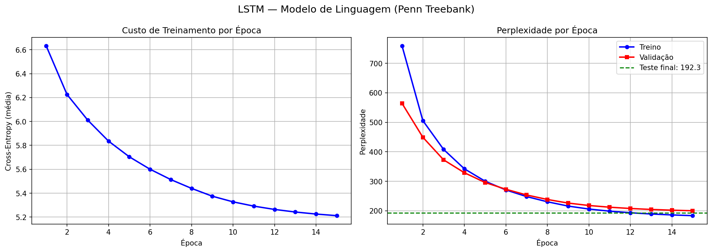
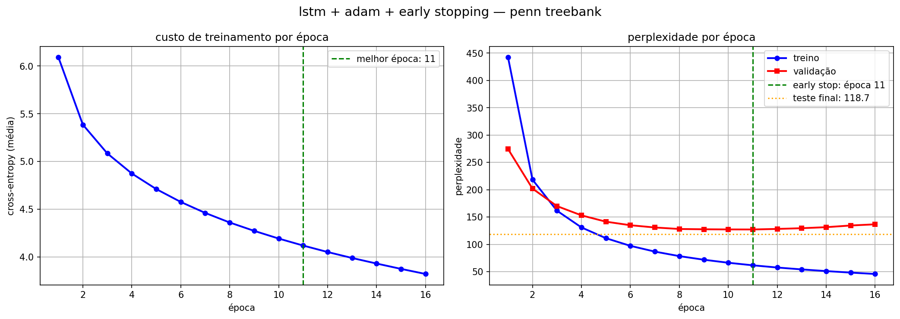
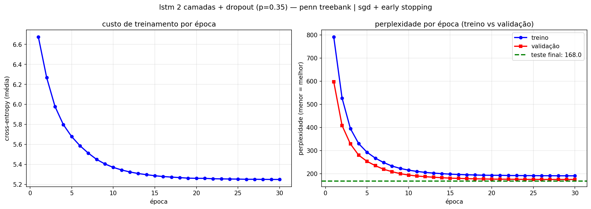

# T2 — Modelo de Linguagem com LSTM

**Disciplina:** GEX1083 - Tópicos Especiais em Computação XXIII - Deep Learning  
**Aluna:** Rafaela Moreno  
**Instituição:** Universidade Federal da Fronteira Sul — Campus Chapecó

---

## Dataset — Penn Treebank (PTB)

O PTB é um corpus de texto jornalístico com ~10.000 palavras únicas no vocabulário. Palavras raras são substituídas por `<unk>`, números por `N` e fim de sentença por `<eos>`.

- **929.589 tokens** de treino | **73.760** de validação | **82.430** de teste

A métrica principal é a **perplexidade** = exp(cross-entropy média).

---

## Modelo 1 — SGD com Decaimento de Learning Rate

O modelo possui uma camada LSTM com embedding e estado oculto de dimensão 128. A projeção de saída reutiliza a transposta do embedding (weight tying). O otimizador é SGD com decaimento de learning rate a partir da época 8. Não há dropout nem early stopping.

### Hiperparâmetros

| Hiperparâmetro           | Valor                         |
| ------------------------ | ----------------------------- |
| Função de custo          | Cross-Entropy                 |
| Otimizador               | SGD Mini-batch                |
| Taxa de aprendizado      | 1.0 (decai 0.8× após época 8) |
| Tamanho do batch         | 32                            |
| Comprimento da sequência | 35 tokens                     |
| Épocas                   | 15                            |
| Gradient clipping        | norma máxima 5.0              |
| Embed / Hidden size      | 128                           |

### Resultados por época

| Época | Custo Treino | PPL Treino | PPL Validação |
| ----- | ------------ | ---------- | ------------- |
| 1     | 6.6315       | 758.6      | 563.7         |
| 2     | 6.2259       | 505.7      | 449.2         |
| 3     | 6.0111       | 407.9      | 372.7         |
| 4     | 5.8358       | 342.4      | 329.0         |
| 5     | 5.7046       | 300.2      | 295.9         |
| 6     | 5.6004       | 270.5      | 272.9         |
| 7     | 5.5138       | 248.1      | 253.5         |
| 8     | 5.4402       | 230.5      | 238.3         |
| 9     | 5.3748       | 215.9      | 226.1         |
| 10    | 5.3274       | 205.9      | 217.9         |
| 11    | 5.2916       | 198.7      | 212.1         |
| 12    | 5.2640       | 193.2      | 207.7         |
| 13    | 5.2423       | 189.1      | 204.5         |
| 14    | 5.2253       | 185.9      | 202.0         |
| 15    | 5.2119       | 183.4      | 200.1         |

### Métricas finais

| Métrica               | Valor  |
| --------------------- | ------ |
| PPL Treino (época 15) | 183.4  |
| PPL Validação         | 200.1  |
| PPL Teste             | 192.30 |

### Gráfico

### Análise

A perplexidade caiu de forma consistente ao longo das 15 épocas. O gap entre treino (183) e validação (200) é pequeno, indicando boa generalização sem overfitting severo. A partir da época 8, o decaimento do learning rate acelerou a convergência. As curvas ainda estavam descendo na época 15, indicando que mais épocas poderiam melhorar o resultado.

---

## Modelo 2 — Adam com Early Stopping

O modelo possui uma camada LSTM com embedding e estado oculto de dimensão 256. O otimizador é Adam implementado manualmente com acumuladores de primeiro e segundo momento. Early stopping com patience de 5 épocas monitora a PPL de validação e restaura os melhores pesos ao final. Não há dropout.

### Hiperparâmetros

| Hiperparâmetro           | Valor                |
| ------------------------ | -------------------- |
| Função de custo          | Cross-Entropy        |
| Otimizador               | Adam                 |
| Taxa de aprendizado      | 0.001                |
| β1 / β2 / ε              | 0.9 / 0.999 / 1e-8   |
| Tamanho do batch         | 32                   |
| Comprimento da sequência | 35 tokens            |
| Épocas (limite)          | 40 (early stopping)  |
| Gradient clipping        | norma máxima 5.0     |
| Patience                 | 5 épocas sem melhora |
| Embed / Hidden size      | 256                  |

### Resultados por época

| Época | Tempo | Custo  | PPL Treino | PPL Validação |
| ----- | ----- | ------ | ---------- | ------------- |
| 1     | 789s  | 6.0927 | 442.6      | 274.5         |
| 2     | 668s  | 5.3862 | 218.4      | 202.0         |
| 3     | 538s  | 5.0849 | 161.6      | 170.0         |
| 4     | 475s  | 4.8749 | 131.0      | 153.1         |
| 5     | 443s  | 4.7117 | 111.2      | 141.5         |
| 6     | 431s  | 4.5771 | 97.2       | 135.0         |
| 7     | 416s  | 4.4621 | 86.7       | 130.8         |
| 8     | 424s  | 4.3620 | 78.4       | 128.1         |
| 9     | 430s  | 4.2743 | 71.8       | 127.6         |
| 10    | 461s  | 4.1940 | 66.3       | 127.3         |
| 11    | 1422s | 4.1208 | 61.6       | 127.2         |
| 12    | 1084s | 4.0530 | 57.6       | 128.2         |
| 13    | 475s  | 3.9906 | 54.1       | 129.5         |
| 14    | 390s  | 3.9324 | 51.0       | 131.4         |
| 15    | 460s  | 3.8764 | 48.3       | 134.5         |
| 16    | 631s  | 3.8234 | 45.8       | 136.6         |

### Métricas finais

| Métrica                   | Valor  |
| ------------------------- | ------ |
| PPL Treino (melhor época) | 61.6   |
| PPL Validação (melhor)    | 127.2  |
| PPL Teste                 | 118.70 |
| Melhor época              | 11     |
| Época de parada           | 16     |

### Gráfico

### Análise

O Adam convergiu rapidamente nas primeiras épocas, a PPL de validação caiu de 274 para 127 em apenas 11 épocas. O early stopping foi acionado na época 16, restaurando os pesos da época 11. O gap crescente entre treino (61.6) e validação (127.2) é sinal de overfitting. O early stopping ajudou a capturar o ponto ótimo antes da validação piorar.

---

## Modelo 3 — LSTM 2 Camadas + Dropout + SGD com Decaimento

O modelo possui duas camadas LSTM empilhadas, com embedding e estado oculto de dimensão 128. Dropout de 35% é aplicado na entrada do embedding, entre as camadas LSTM e na saída da segunda camada. O otimizador é SGD com decaimento de learning rate a partir da época 8. O early stopping com patience de 4 não foi acionado.

### Hiperparâmetros

| Hiperparâmetro           | Valor                                    |
| ------------------------ | ---------------------------------------- |
| Função de custo          | Cross-Entropy                            |
| Otimizador               | SGD Mini-batch                           |
| Taxa de aprendizado      | 2.0 (decai 0.8× a partir da época 8)     |
| Tamanho do batch         | 32                                       |
| Comprimento da sequência | 35 tokens                                |
| Épocas                   | 30                                       |
| Gradient clipping        | norma máxima 5.0                         |
| Dropout                  | p=0.35 (embedding, entre camadas, saída) |
| Patience (early stop)    | 4 (não acionado)                         |
| Embed / Hidden size      | 128                                      |

### Resultados por época

| Época | Tempo | LR      | Custo  | PPL Treino | PPL Validação |
| ----- | ----- | ------- | ------ | ---------- | ------------- |
| 1     | 404s  | 2.00000 | 6.6735 | 791.2      | 597.5         |
| 2     | 459s  | 2.00000 | 6.2671 | 526.9      | 408.2         |
| 3     | 329s  | 2.00000 | 5.9792 | 395.1      | 328.8         |
| 4     | 518s  | 2.00000 | 5.7985 | 329.8      | 279.7         |
| 5     | 429s  | 2.00000 | 5.6786 | 292.5      | 253.2         |
| 6     | 296s  | 2.00000 | 5.5872 | 267.0      | 234.4         |
| 7     | 355s  | 2.00000 | 5.5134 | 248.0      | 218.9         |
| 8     | 239s  | 1.60000 | 5.4508 | 232.9      | 208.6         |
| 9     | 276s  | 1.28000 | 5.4050 | 222.5      | 199.9         |
| 10    | 250s  | 1.02400 | 5.3711 | 215.1      | 193.9         |
| 11    | 252s  | 0.81920 | 5.3451 | 209.6      | 189.7         |
| 12    | 281s  | 0.65536 | 5.3249 | 205.4      | 186.9         |
| 13    | 305s  | 0.52429 | 5.3095 | 202.3      | 184.5         |
| 14    | 272s  | 0.41943 | 5.2979 | 199.9      | 182.4         |
| 15    | 266s  | 0.33554 | 5.2873 | 197.8      | 180.5         |
| 16    | 268s  | 0.26844 | 5.2795 | 196.3      | 179.4         |
| 17    | 357s  | 0.21475 | 5.2738 | 195.1      | 178.4         |
| 18    | 281s  | 0.17180 | 5.2688 | 194.2      | 177.5         |
| 19    | 286s  | 0.13744 | 5.2632 | 193.1      | 177.0         |
| 20    | 273s  | 0.10995 | 5.2616 | 192.8      | 176.3         |
| 21    | 277s  | 0.08796 | 5.2613 | 192.7      | 176.0         |
| 22    | 288s  | 0.07037 | 5.2573 | 192.0      | 175.8         |
| 23    | 287s  | 0.05629 | 5.2559 | 191.7      | 175.4         |
| 24    | 269s  | 0.04504 | 5.2547 | 191.5      | 175.2         |
| 25    | 265s  | 0.03603 | 5.2539 | 191.3      | 175.2         |
| 26    | 265s  | 0.02882 | 5.2520 | 190.9      | 175.0         |
| 27    | 262s  | 0.02306 | 5.2519 | 190.9      | 174.9         |
| 28    | 274s  | 0.01845 | 5.2509 | 190.7      | 174.8         |
| 29    | 275s  | 0.01476 | 5.2505 | 190.7      | 174.8         |
| 30    | 269s  | 0.01181 | 5.2499 | 190.6      | 174.7         |

### Métricas finais

| Métrica               | Valor        |
| --------------------- | ------------ |
| PPL Treino (época 30) | 190.6        |
| PPL Validação         | 174.7        |
| PPL Teste             | 168.01       |
| Early stopping        | não acionado |

### Gráfico

### Análise

A PPL de validação melhorou monotonicamente em todas as 30 épocas, por isso o early stopping não foi acionado. A PPL de treino maior que a de validação (190.6 vs 174.7) é efeito esperado do dropout. Na avaliação, o dropout é desativado. O decaimento agressivo do LR (de 2.0 para 0.01 ao longo de 22 épocas) fez o progresso desacelerar progressivamente, com ganhos marginais nas últimas épocas.

---

## Comparação entre os modelos

| Métrica             | Modelo 1 (SGD)      | Modelo 2 (Adam)   | Modelo 3 (SGD + Dropout + 2 camadas) |
| ------------------- | ------------------- | ----------------- | ------------------------------------ |
| Otimizador          | SGD + decaimento LR | Adam + early stop | SGD + decaimento LR                  |
| Camadas LSTM        | 1                   | 1                 | 2                                    |
| Dropout             | não                 | não               | p=0.35                               |
| Épocas treinadas    | 15                  | 16 (early stop)   | 30                                   |
| PPL Treino final    | 183.4               | 61.6              | 190.6                                |
| PPL Validação final | 200.1               | 127.2             | 174.7                                |
| **PPL Teste**       | 192.30              | **118.70**        | 168.01                               |

O Modelo 2 (Adam) obteve a melhor PPL de teste (118.70), com convergência muito rápida (atingiu o melhor ponto na época 11) e early stopping evitando overfitting severo. O Modelo 3 (2 camadas + dropout) ficou em segundo (168.01), com regularização eficaz mas otimizador menos eficiente. O Modelo 1 (SGD base) serve como linha de base (192.30). Uma possível combinação (analisando os cenários testados) seria Adam + dropout + 2 camadas, mas não foi implementada neste trabalho devido ao tempo de execução.
